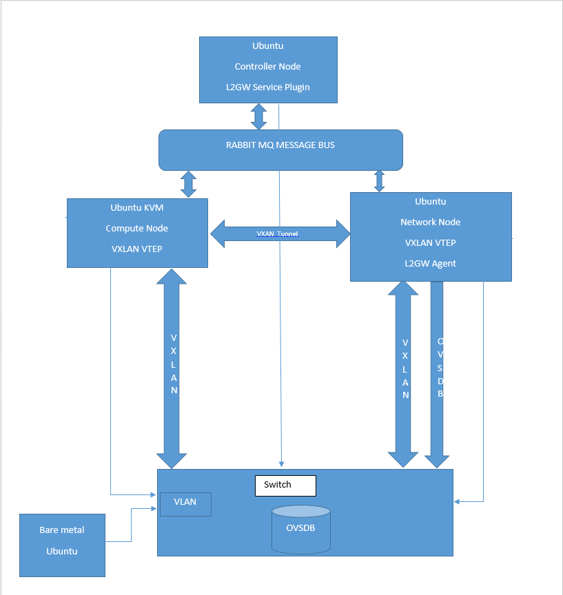

========
Overview
========

.. _whatisl2gw:

1. What is L2 Gateway
=============================

L2 Gateway (L2GW) is an API framework for OpenStack that offers bridging two or more networks together to make them look at a
single broadcast domain. A typical use case is bridging the virtual with the physical networks

.. _model:

2. The L2GW model
=================

L2GW introduces a various models to describe the relationships between logical and the physical entities.

========================= ====================================================================
   Models                       Description
========================= ====================================================================
l2gateways                logical gateways that represents for the set of physical devices
l2gatewaydevices          l2 gateway devices that represents for logical gateways.
l2gatewayinterfaces       it represents the physical ports for the devices
l2gatewayconnections      represents connection between neutron network and the logical gateway

========================= =====================================================================

.. _usage:

3. L2GW NB API usage
=====================

L2GW NB REST API definitions are below,

3.1 Create l2gateway: neutron-l2gw l2-gateway-create <l2gateway-name> --device name="<device_name>",interface_names=”<interface_name1>|[<segid1] ; <interface_name2>|[<segid2]”
Note : segid is an optional parameter , if it’s not provided while creating l2gateway , it needs to be provided while creating l2-gateway-connection

3.2 List l2gateways: neutron-l2gw l2-gateway-list

3.3 Show l2gateway: neutron-l2gw l2-gateway-show <l2gateway-id/l2gateway-name>

3.4 Delete l2gateway: neutron-l2gw l2-gateway-delete <l2gateway-id/l2gateway-name>

3.5 Update l2gateway: neutron-l2gw l2-gateway-update <l2gateway-id/l2gateway-name> --name <new l2gateway-name> --device name=<device_name>,interface_names=”<interface_name1>|[<segid1] ; <interface_name2>|[<segid2]”

3.6 Create l2gateway-connection: neutron-l2gw l2-gateway-connection-create <l2gateway-id > <network-id> --default-segmentation-id [seg-id]

3.7 List l2gateway-connection: neutron-l2gw l2-gateway-connection-list

3.8 Show l2gateway-connection: neutron-l2gw l2-gateway-connection-show <l2gateway-connection-id>

3.9 Delete l2gateway-connection: neutron-l2gw l2-gateway-connection-delete <l2gateway-connection-id>

.. _l2gw_agent:

4. L2GW agent
=============
Configure the OVSDB parameters in /etc/neutron/l2gateway_agent.ini in case for openstack deployment.
Ex:
[ovsdb
ovsdb_hosts = ovsdb1:127.0.0.1:6632

In devstack local.conf will do a trick.(Refer - networking-l2gw/devstack/README.rst)
L2GW agent will be listed as part of “neutron agent-list”.
Details of L2GW Agent can be seen using “neutron agent-show <agent-id>” command
L2 Gateway Agent connects to ovsdb server to configure and fetch L2 Gateways

.. _l2gw_deployment:

5. L2GW Deployment
==================

.. _l2gw_release_management

6. L2GW Package Versioning and Release Management
=================================================

Versioning of L2 Gateway Package
--------------------------------
L2 Gateway package will be uploaded, as networking-l2gw,
to https://pypi.python.org.
In order to upload this package, it will be versioned.
Any subsequent updates will require version updates.
This sub-section describes the versioning and release management of this package.

By keeping L2 Gateway repository out of Neutron main repository gives us
flexibility in terms of development and enhancements.
This flexibility is extended for versioning of this project as well - this
means, if we wanted to, we could version this project sequentially.
This means whenever a new fix is released, we could bump up the version to
the next number.

Flexibility comes with cost. Thinking in terms of future, assuming this API
is deployed by many users along with different releases of Neutron.
Many enhancements/fixes may be introduced to this project.
If we incremented the version/release number sequentially, this may force
uninterested users to upgrade as well.
This may or may not be desirable. Therefore, following release/versioning
proposal is suggested for this package.

Versioning of L2 Gateway will be aligned closely with Neutron releases.
Neutron releases are formatted as follows::

       <year>.<major-release>.<minor-release>

       year = 2015, 2014, etc...
       major-release = 1 or 2  - only two releases in a year
       minor-release = 1,2,3 or b1,b2,b3, or rc1,rc2,rc3, etc

       2015.1.1, 2014.2.rc2, etc…

L2 Gateway package is versioned in the same manner with an exception that the
last tuple is used for intermediate patches/fixes between major release.
As an example, the first release will be::

       2015.1.X   where X will continue to increment as we add fixes to this release

When kilo is released, L2 Gateway repository will also be tagged as kilo/stable
to match with Neutron release.
At this time the version of this package will be tagged to
2015.1.X ("X" will continue to increase as bug fixes are added to kilo/stable).
For liberty release, the version of this package will be changed to 2015.2.Y.
All the new features will be added to 2015.2.Y and all the bug fixes for kilo
will be back-ported to 2015.1.X.
This gives the flexibility of keeping the contents/features of this package
closely aligned with Neutron releases.

Which Version of L2 Gateway Package to use?
-------------------------------------------

Anybody who wants to use L2 Gateway package, they can install it by issuing::

       pip install networking-l2gw

This will always pick the latest version of the package.
However, for those users who are already using this package and want to pick
up point fixes for a given release may use the specific version.
For example, if a user wants to pick the latest version of the package that is
suitable for kilo/stable, may use the following::

       pip install networking-l2gw>=2015.1.X,<2015.2.0

For information on deploying L2GW refer networking-l2gw/doc/source/installation.rst  and  in devstack , networking-l2gw/devstack/README.rst
